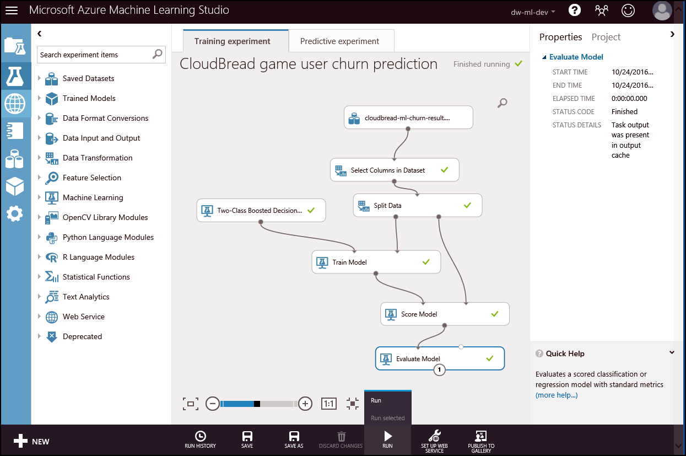

# azure-ml-busan 캠프 발표 자료 
Azure Machine Learning Camp in Busan

이 Repo는 Azure Machine Learning in 부산 - 발표자료 & 실습자료 Repo임
- Azure Machine Learning in 부산 : http://onoffmix.com/event/103412/  
- Github URL : https://github.com/CloudBreadPaPa/azure-ml-busan  

### repo를 fork 후, clone 또는 download 수행
본 repo는 camp에서 순차적으로 진행됨. Repo를 fork 후 clone 하거나 download 수행  

### 모바일 게임 데모 데이터
Game 데모 데이터는 가상의 모바일 게임사 시나리오에서 사용되는 게임사의 사용자 정보 예제 데이터임  
https://github.com/CloudBreadPaPa/azure-ml-busan/tree/master/data 폴더 하위 참조  

### Game 이탈 예측 모델 구축 데모
Game 데이터에 대한 구조 이해  

### 단계별 모델 구축
- Machine Learning 모델을 생성  
-   

### 실시간 예측 분석 ###
위의 공개한 분석모델을 활용해 예측모델(Predict model)을 구축하고 API를 통해 실시간 예측을 수행하는 것이 목표.

- Machine Learning 모델을 생성 후, Resfult API로 Azure Machine Learning 모델 생성

- 학습 모델을 실행하고, Test 예측 결과 확인

- 예측 모델(Predictive model)로 생성 후 API Web Service로 배포

- 생성된 Web service의 API Key를 이용해 C# 코드에서 real-time predict 수행 (코드 폴더 참조)

    ```
    public class UserChurnController : ApiController  
    {
        // POST api/UserChurn
        public HttpResponseMessage POST(CBChurn p)
        {
            // Machine Learning 분석 요청
            InvokeRequestResponseService(p).Wait();
            ...
        }

        // Machine Learning Web Service 호출
        static async Task InvokeRequestResponseService(CBChurn p)
        {
            ...
            const string apiKey = "API키-수정"; // Replace this with the API key for the web service
            client.DefaultRequestHeaders.Authorization = new AuthenticationHeaderValue("Bearer", apiKey);
            client.BaseAddress = new Uri("Machine-Learning-Web-Service-URL-수정");
            HttpResponseMessage response = await client.PostAsJsonAsync("", scoreRequest).ConfigureAwait(false);
            if (response.IsSuccessStatusCode)
            {
                string result = await response.Content.ReadAsStringAsync();
                Debug.WriteLine("Result: {0}", result);
                p.ChurnYN = result;
            }
            ...
        }
    }
    ```

-   

- Machine Learning API Controller를 publish 하고, 코드를 실행해 테스트 하거나, Postman 등에서 테스트 수행해 real-time prediction 수행

- Batch 작업을 수행하기 위해서 Machine Learning Batch execution이 제공하는 코드 이용이 가능.  

-   

- 추가적으로, Functions를 이용해 server-less로 batch 호출 역시 가능  

-   

- Excel을 이용해 Batch 분석도 가능  


### Python + Machine Learning 데모 코드
Azure Machine Learning이 노출하는 API를 Python에서 호출하는 예제 수행  

Iris 데이터를 호출해 RRE를 수행하는 예제  
python 폴더 하위의 ml-Iris.py 파일 참조  

```
import urllib2
# If you are using Python 3+, import urllib instead of urllib2

import json 


data =  {

        "Inputs": {

                "input1":
                {
                    "ColumnNames": ["Sepal.Length", "Sepal.Width", "Petal.Length", "Petal.Width", "Species"],
                    "Values": [ [ "0", "0", "0", "0", "" ], [ "1", "1", "1", "1", "" ], ]
                },        },
            "GlobalParameters": {
}
    }

body = str.encode(json.dumps(data))

url = 'https://asiasoutheast.services.azureml.net/workspaces/<ML-API-URL>'
api_key = '<API-KEY>' # Replace this with the API key for the web service
headers = {'Content-Type':'application/json', 'Authorization':('Bearer '+ api_key)}

req = urllib2.Request(url, body, headers) 

try:
    response = urllib2.urlopen(req)

    # If you are using Python 3+, replace urllib2 with urllib.request in the above code:
    # req = urllib.request.Request(url, body, headers) 
    # response = urllib.request.urlopen(req)

    result = response.read()
    print(result) 
except urllib2.HTTPError, error:
    print("The request failed with status code: " + str(error.code))

    # Print the headers - they include the requert ID and the timestamp, which are useful for debugging the failure
    print(error.info())

    print(json.loads(error.read()))                 

```

User Churn Predition을 수행하는 RRE를 수행하는 예제  
python 폴더 하위의 ml-user-churn.py 파일 참조  

```
import urllib2
# If you are using Python 3+, import urllib instead of urllib2

import json 


data =  {

        "Inputs": {

                "input1":
                {
                    "ColumnNames": ["MemberID", "LastLoginDT", "Level", "Exps", "Points", "SumItemCount", "SumPurchasePrice", "ChurnYN"],
                    "Values": [ [ "value", "value", "0", "0", "0", "0", "0", "value" ], [ "value", "value", "0", "0", "0", "0", "0", "value" ], ]
                },        },
            "GlobalParameters": {
}
    }

body = str.encode(json.dumps(data))

url = 'https://asiasoutheast.services.azureml.net/workspaces/<ML-API-URL>'
api_key = '<API-KEY>' # Replace this with the API key for the web service
headers = {'Content-Type':'application/json', 'Authorization':('Bearer '+ api_key)}

req = urllib2.Request(url, body, headers) 

try:
    response = urllib2.urlopen(req)

    # If you are using Python 3+, replace urllib2 with urllib.request in the above code:
    # req = urllib.request.Request(url, body, headers) 
    # response = urllib.request.urlopen(req)

    result = response.read()
    print(result) 
except urllib2.HTTPError, error:
    print("The request failed with status code: " + str(error.code))

    # Print the headers - they include the requert ID and the timestamp, which are useful for debugging the failure
    print(error.info())

    print(json.loads(error.read()))                 

```

EOF